# namanipie

`cs student` · `building things` · `breaking things`

 

&nbsp;

 

---

## things i'm building

<table>
<tr>

<td width="50%" valign="top">

### MarkMint

Exam intelligence built around past papers, study material, and academic data.

Currently working on the crawling, processing, question-family pipeline, and prediction system.

 

`Python` `PostgreSQL` `data` `web`

  

<a href="https://github.com/namanipie/markmint">
→ github
</a>

</td>

<td width="50%" valign="top">

### Console

A student-focused dashboard that pulls institutional data, handles local caching, visualizes attendance, and sends notifications.

 

`Flutter` `Dart` `Firebase` `Python`

  

<a href="https://github.com/namanipie">
→ github
</a>

</td>

</tr>
</table>

 

### more

<a href="https://namanipie.github.io/namanio/">
my website
</a>

&nbsp;&nbsp;·&nbsp;&nbsp;

<a href="https://github.com/namanipie?tab=repositories">
all repositories
</a>

 

---

## stack

 

 

---

## github

 

 

 

 

---

building in public · 2026

